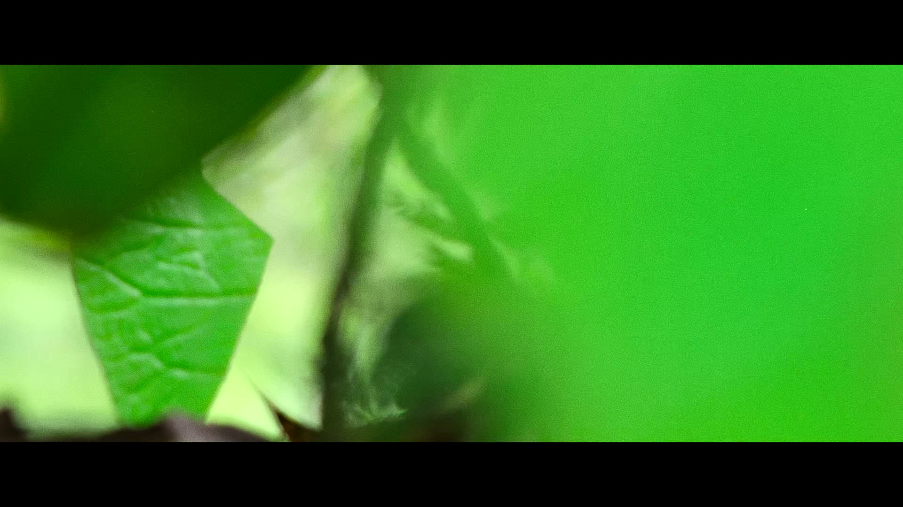

# Universal Film Grain Toolkit

使用 **FFmpeg + NVIDIA GPU** 为数字视频添加电影胶片质感，提供两条可切换的处理路线：

- **HEVC Main10 + 真实扫描 Grain Plate**：将真实胶片颗粒合成到视频像素中。
- **AV1 Main10 + grav1synth Film Grain**：将颗粒模型写入 AV1 Film Grain metadata，由播放器解码时合成。

当前稳定基准：

`FilmGrain_Universal_HEVC_AV1_v32_Grav1synth_LUTGallery.bat`

默认使用 **AV1** 编码和 **MP4** 容器，并集成 LUT Gallery、电影画幅、自动电影帧率、多文件拖放、RTX 4080 NVENC 参数及 AV1 Film Grain 验证。

<table>
  <tr>
    <td width="50%" align="center"><a href="images/Original.jpg"></a><br><sub>Original Video</sub></td>
    <td width="50%" align="center"><a href="images/FG_CT35_V20FAST_HEVC_239LB_23976p.mkv_20260830_102847.766.jpg"></a><br><sub>HEVC + Real Scanned Film Grain</sub></td>
  </tr>
</table>

---

## 两种 Film Grain 路线

真实胶片颗粒具有随机性、亮度相关性和持续变化的空间结构。把颗粒直接写进像素，可以获得稳定、真实且与播放器无关的效果，但随机细节也会明显增加编码压力。

AV1 Film Grain Synthesis 采用另一种思路：编码相对干净的画面，并在码流中保存颗粒模型参数，播放时再由解码器生成颗粒，因此更适合低码率和高速批量处理。

参考：[AOMedia AV1 Tool Description](https://aomedia.org/docs/AV1_ToolDescription_v11-clean.pdf)

| 项目 | HEVC + 扫描 Grain | AV1 + grav1synth |
|---|---|---|
| Grain 来源 | 真实胶片扫描素材 | Film Preset 或 Photon ISO 模型 |
| 是否写进像素 | 是 | 否，由解码器合成 |
| 低码率效率 | 较低 | 很高 |
| 播放兼容性 | 较好 | 依赖播放器正确支持 AV1 Film Grain |
| 画面一致性 | 不同播放器效果一致 | 可能受解码器实现影响 |
| 典型用途 | 收藏、真实扫描颗粒 | 高效率压缩、批量转码 |

两种方案长期并存，并不存在绝对替代关系。

---

## 当前工具包结构

```text
FilmGrain_Universal_HEVC_AV1_v32_Grav1synth_LUTGallery.bat
AV1_FilmGrain_Bake_for_Social_Upload_v1.3.bat
AV1_Grav1synth_Add_Replace_FilmGrain_NoReencode_v1.1.bat
LUT_Preview_Batch_v2.3_Gallery.bat
README_v32.txt
_LUT_Tools\
    LUT_Gallery_Selector.ps1
    LUT_Preview_Batch_v2.3_Gallery.ps1
    LUT_Reference_Default.jpg
Utils\
    FilmGrain_MOV_to_1080p_HEVC_Lossless_Cache.bat
    FilmGrain_MOV_to_HEVC_Lossless_Cache.bat
    build-grav1synth-windows-fork-patched-v2.yml
```

请保持主 BAT、LUT 预览 BAT 与 `_LUT_Tools` 文件夹的相对位置不变。`Utils` 用于保存辅助生成和构建工具，不参与主脚本的日常运行。

| 文件 | 用途 |
|---|---|
| `FilmGrain_Universal_HEVC_AV1_v32_Grav1synth_LUTGallery.bat` | HEVC/AV1 整合主脚本，日常转码入口 |
| `AV1_FilmGrain_Bake_for_Social_Upload_v1.3.bat` | 将 AV1 Film Grain 烘焙到像素并输出 H.264/AAC MP4 |
| `AV1_Grav1synth_Add_Replace_FilmGrain_NoReencode_v1.1.bat` | 不重新编码视频，为现有 AV1 添加或替换 Film Grain metadata |
| `LUT_Preview_Batch_v2.3_Gallery.bat` | 批量生成 LUT Gallery 预览图和索引 |
| `_LUT_Tools` | Gallery 界面、缩略图生成逻辑及默认参考图 |
| `Utils\FilmGrain_MOV_to_1080p_HEVC_Lossless_Cache.bat` | 将原始 Grain MOV 制作为 1080p HEVC Main10 Lossless Cache |
| `Utils\FilmGrain_MOV_to_HEVC_Lossless_Cache.bat` | 将原始 Grain MOV 制作为 4K/原分辨率 HEVC Main10 Lossless Cache |
| `Utils\build-grav1synth-windows-fork-patched-v2.yml` | 通过 GitHub Actions 构建项目使用的 Windows x64 grav1synth |

---

## 环境与固定路径

当前版本按以下 Windows 环境测试和配置：

```text
GPU：RTX 4080
FFmpeg：E:\EnCoder\FFMpeg\13.0\bin\ffmpeg.exe
FFprobe：E:\EnCoder\FFMpeg\13.0\bin\ffprobe.exe
grav1synth：E:\EnCoder\FFMpeg\grav1synth\grav1synth.exe
HEVC Grain 库：D:\Film_Grain
LUT 根目录：E:\Adobe Portable\LUTs
```

> `E:\EnCoder\FFMpeg\13.0` 中的 `13.0` 表示 **NVENC API 13.0 兼容构建**，不是 FFmpeg 的正式版本号。

RTX 4080 默认启用：

```text
B-frames：4
B-reference mode：middle
Temporal AQ：开启
Spatial AQ：开启
AQ Strength：8
主视频 NVDEC：开启
```

RTX T600 Laptop 等不支持当前参数的显卡，应在主脚本顶部设置：

```bat
set "ENABLE_BF=0"
set "ENABLE_TEMPORAL_AQ=0"
```

---

## 快速开始

1. 按固定路径放置 FFmpeg、FFprobe、grav1synth、Grain 素材与 LUT。
2. 保持工具包目录结构不变。
3. 将一个或多个视频拖到：

```text
FilmGrain_Universal_HEVC_AV1_v32_Grav1synth_LUTGallery.bat
```

4. 按菜单选择处理方式；直接回车采用默认值。
5. 完成后查看成功、失败和跳过数量。

输出文件已存在时，脚本会跳过，不会直接覆盖现有结果。

---

## v32 当前默认值

| 项目 | 默认值 |
|---|---|
| 编码与 Grain 方式 | AV1 Main10 + grav1synth |
| 输出容器 | MP4 |
| 速度模式 | FAST：p5 / qres multipass / lookahead 16 |
| 电影画幅 | 约 2.39:1 |
| 输出帧率 | Auto Cinematic FPS |
| LUT | 不使用 |
| AV1 Grain 来源 | Film Preset |
| AV1 Film Preset | Classic35 / Fujifilm Eterna 250D |
| AV1 平均码率 | 1500 kbps |
| HEVC 平均码率 | 7500 kbps |
| 社交平台上传副本 | 关闭 |

### 容器行为

**MP4（默认）**：音频转换为 AAC 320 kbps，启用 `faststart`，不写入不兼容的字幕、附件和数据流。

**MKV**：尽量复制并保留原音频、字幕、附件、数据流、章节与 metadata，更适合完整归档。

---

## HEVC：真实扫描 Film Grain

HEVC 后端以稳定 HEVC v7.17 处理链为基础：

```text
原始视频 + 真实扫描 Grain Plate
            ↓
     Vulkan Overlay
            ↓
  P010 / HEVC Main10 NVENC
            ↓
        MP4 或 MKV
```

主要特点：

- 使用真实 35mm、Super 35、16mm、Super 16 或 8mm Grain Plate；
- 递归搜索 `D:\Film_Grain` 子目录；
- 支持 Light/Heavy 素材和自定义 Grain 文件夹；
- 支持 Grain 透明度；
- 使用 `scale_vulkan` 与 `blend_vulkan` 完成 GPU 缩放和 Overlay；
- 支持 LUT、电影帧率、MP4/MKV 和多文件批量处理。

### Cinematic Style

HEVC 的 `Cinematic style` 会在保持原始分辨率的情况下添加约 **2.39:1** 上下黑边。

例如 1920×1080 输入仍输出 1920×1080。黑边在 Grain 合成后添加，因此黑色区域不会叠加颗粒。

### Grain Cache

主脚本仍支持预先制作的：

```text
*_1080p_HEVC_Lossless.mkv
*_HEVC_Lossless.mkv
```

选择规则：

```text
≤ 1920×1080 → 优先使用 1080p Cache
> 1920×1080 → 优先使用 4K Cache
```

找不到 Cache 时可以回退到原始 Grain MOV。需要生成 Cache 时，可使用 `Utils` 目录中的：

```text
FilmGrain_MOV_to_1080p_HEVC_Lossless_Cache.bat
FilmGrain_MOV_to_HEVC_Lossless_Cache.bat
```

两个脚本会将原始 Grain MOV 批量转换为 HEVC Main10 Lossless Cache。1080p 版本还会对转换前后的 P010 像素流执行 SHA-256 校验，用于确认 Cache 解码后的 Grain 像素与预处理结果一致。

免费 Grain Plate 素材：

- [TDCAT Free DCI 4K Film Grain Plates](https://tdcat.squarespace.com/downloads/filmgrain)
- [Cinema Tools 4K DCI 35mm Film Grain](https://www.cinematools.co/film-grain)

推荐目录结构：

```text
D:\Film_Grain\
├─ CinemaTools\
├─ TDCAT-Light\
└─ TDCAT-Heavy\
```

---

## AV1：grav1synth Film Grain

AV1 后端以稳定 AV1 v7.15 处理链为基础：

```text
原始视频
    ↓
AV1 Main10 NVENC
    ↓
IVF 临时视频流
    ↓
grav1synth 写入 Film Grain metadata
    ↓
恢复原片音频及容器内容
    ↓
grav1synth inspect 验证
    ↓
MP4 或 MKV
```

这里的 Grain 不会在编码阶段直接写进每一个像素。播放器解码 AV1 时，根据码流中的 Film Grain 参数实时生成颗粒。

### Film Preset

默认推荐模式：

```text
Classic35
Modern35
16mm
Super8
MaxMid
```

Classic35、Modern35 和 16mm 还可以选择 Fujifilm Eterna 250D/500T、Kodak Vision3 250D/200T。

### Photon ISO

高级模式提供 ISO 400、800、1600、3200、6400 和 Custom ISO，并可选择 `Luma only` 或 `Luma + chroma`。

### AV1 的 2.39:1 画幅

AV1 路线采用 **Active Picture Crop**，而不是把黑边编码进视频：

```text
1920×1080 → 约 1920×804
```

这样可以避免 Film Grain 模型影响黑边，同时减少对黑色区域的无效编码。全屏播放时由播放器或显示设备补充黑边。

### 最终验证

AV1 任务完成前会运行 `grav1synth inspect`。只有最终输出中的 Film Grain 信息通过检查，任务才会计为成功。

项目链接：

- [rust-av / grav1synth](https://github.com/rust-av/grav1synth)
- [本项目使用的 Windows 修订版仓库](https://github.com/rampageX/grav1synth)

需要自行构建 Windows x64 版本时，可使用：

```text
Utils\build-grav1synth-windows-fork-patched-v2.yml
```

该文件用于 GitHub Actions Windows Runner，对应本项目实际使用的修订版 grav1synth 构建流程。

---

## 自动电影帧率

主脚本提供：

```text
[1] Keep source FPS
[2] Auto cinematic FPS（默认）
```

自动模式将常见 NTSC fractional 帧率族转换为 **23.976 fps**，将常见整数/PAL 帧率族转换为 **24.000 fps**。无法可靠匹配的特殊帧率会保留源帧率。

脚本使用 CFR 输出并保持正常视频时长；特殊 VFR 素材仍建议检查音画同步。

---

## LUT Gallery 与 Film Look

v32 集成可视化 LUT Gallery，默认 LUT 根目录为：

```text
E:\Adobe Portable\LUTs
```

运行 `LUT_Preview_Batch_v2.3_Gallery.bat` 可生成预览图和 Gallery index。

缩略图生成器支持递归扫描、默认或自定义参考素材、Junction/Symlink、防循环、1920 宽预览及 Resolve CUBE 兼容处理。

Gallery 支持：

- 缩略图显示、Recent、Favorites；
- 文件夹筛选、搜索、分页；
- 右键菜单和双击选择；
- Enter 确认、PageUp/PageDown 翻页、Esc 取消。

选定 LUT 后，主脚本使用 tetrahedral 插值，并允许设置 LUT 强度。

---

## 社交平台上传母版

视频平台通常会重新编码上传文件，原始 AV1 Film Grain metadata 很可能无法继续保留。项目提供两种生成上传母版的方式。

### 整合主脚本内生成

AV1 菜单可选择 `Bake Film Grain to pixels + H.264 MP4`。启用后，主脚本在生成 AV1 成片后，再额外输出一份 H.264/AAC MP4。

### 独立工具 v1.3

将一个或多个已带 AV1 Film Grain 的文件拖到：

```text
AV1_FilmGrain_Bake_for_Social_Upload_v1.3.bat
```

```text
AV1 + Film Grain metadata
    ↓ libdav1d 解码并合成颗粒像素
H.264 NVENC
    ↓
AAC 320k / MP4 / faststart
```

输出文件名带 `_UPLOAD_H264_GRAIN.mp4`，适合作为 YouTube、哔哩哔哩、抖音、腾讯视频等平台的通用上传母版。

---

## 为现有 AV1 免重编码添加或替换 Film Grain

将一个或多个已有 AV1 视频拖到：

```text
AV1_Grav1synth_Add_Replace_FilmGrain_NoReencode_v1.1.bat
```

```text
现有 AV1 视频
    ↓ stream copy
IVF
    ↓ grav1synth --replace
带新 Film Grain 的 AV1
    ↓ remux
MKV 或 MP4
    ↓
grav1synth inspect
```

特点：

- AV1 视频流不重新编码；
- 没有 Film Grain 时执行添加，已有时执行替换；
- 默认输出 MKV 并保留原始流；
- MP4 模式转换音频为 AAC 320 kbps，并省略字幕、附件和数据流；
- 失败时默认保留临时目录和日志；
- 非 AV1 视频会被跳过。

> “No Re-encode”仅指视频流。选择 MP4 时，音频仍会转换为 AAC。

---

## FFmpeg 与 NVIDIA 驱动

当前稳定环境使用 NVIDIA Driver 596.49，以及采用 NVENC API 13.0 headers 构建的 FFmpeg：

```text
BtbN FFmpeg Auto-Build
Date    : 2026-04-30 13:44
Version : N-124278-gcc3ca17127
Target  : Windows x86_64
Variant : GPL static
```

- [对应的 BtbN Release](https://github.com/BtbN/FFmpeg-Builds/releases/tag/autobuild-2026-04-30-13-44)
- [BtbN / FFmpeg-Builds](https://github.com/BtbN/FFmpeg-Builds)

最低驱动要求取决于 FFmpeg 构建采用的 NVENC API / `nv-codec-headers`，不能只根据 FFmpeg 主版本号判断。

升级驱动或 FFmpeg 后，至少确认：

```bat
ffmpeg -hide_banner -encoders | findstr /i "hevc_nvenc av1_nvenc"
ffmpeg -hide_banner -filters  | findstr /i "blend_vulkan scale_vulkan"
ffmpeg -hide_banner -hwaccels | findstr /i "cuda vulkan"
ffmpeg -hide_banner -h decoder=libdav1d
```

同时重新检查：

- HEVC/AV1 Main10 输出；
- Vulkan Grain 合成的亮度、格式和帧同步；
- 23.976/24 fps 转换后的时长与音画同步；
- MP4/MKV 的音频、字幕、附件和章节行为；
- AV1 最终文件能否通过 `grav1synth inspect`；
- 新环境的实际 `speed=` 与 `elapsed=`。

不要把外部新 FFmpeg 目录中的 DLL 覆盖到 grav1synth 目录，二者的运行时依赖应保持独立。

---

## 已知限制

- 仅面向 Windows BAT/PowerShell 工作流；
- 当前默认硬件参数以 RTX 4080 为目标；
- HEVC 扫描 Grain 会增加编码压力和所需码率；
- AV1 Film Grain 的显示依赖播放器和解码器正确实现 Film Grain Synthesis；
- 部分平台和转码软件会移除 AV1 Film Grain metadata；
- MP4 兼容模式不会保留字幕、附件和数据流；
- AV1 使用 CPU `lut3d/blend` 时，主画面解码会切换为软件路径；
- 特殊 HDR、VFR、多视频流或非常规容器建议先用短片测试；
- 重要素材应保留原文件，并在归档前检查画面、音频、时长、流信息和 Film Grain 验证结果。

---

## 如何选择

选择 **HEVC + 真实扫描 Grain**，如果你更重视真实 Grain Plate 的具体质感、不依赖播放器生成颗粒，以及更广泛的播放兼容性。

选择 **AV1 + grav1synth**，如果你更重视较低码率、快速批量处理，以及低码率下仍能保留明显颗粒。

当前项目默认推荐：

> **AV1 Main10 + grav1synth Film Grain，输出 MP4。**

需要向社交或视频平台上传时，再生成一份将 Grain 烘焙到像素的 H.264 MP4 上传母版。
