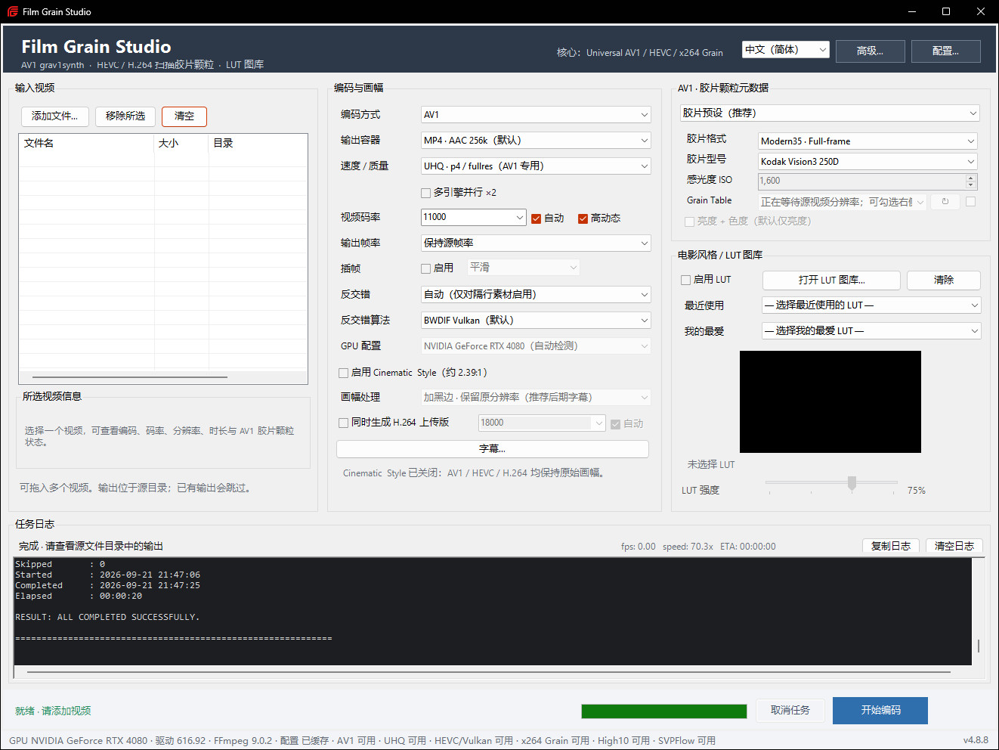

# Film Grain Studio

基于 **FFmpeg、NVIDIA NVENC、libx264 与 grav1synth** 的 Windows 视频胶片化工具包，同时提供图形界面和命令行入口。

项目提供三条同级主编码路线：

- **AV1 Main10 + grav1synth Film Grain**：将颗粒模型写入 AV1 Film Grain metadata，由播放器在解码时合成；除内置 Film Preset / Photon ISO 外，还可直接加载现成 `.tbl / .txt` Grain Table。
- **HEVC Main10 + 真实扫描 Grain Plate**：将真实胶片颗粒合成到视频像素中，由 NVENC Main10 编码。
- **H.264 x264 Grain + 真实扫描 Grain Plate**：与 HEVC 共用扫描 Grain / LUT / 画幅 / 反交错 / OpenSVPFlow 前处理，使用 `libx264 + preset faster + tune grain + VBR 单次` 作为默认日常路线；高级设置可选择 Medium / Slow 与 VBR 2-Pass。默认在编码边界高质量降为 8-bit High Profile，也可启用实验性 High10。

当前正式稳定版为 **v4.6.2.1**，发布包名称：

```text
FilmGrain_Studio_v4.6.2.1_Stable.zip
```

所有独立脚本使用固定文件名，不再包含组件版本号；版本号只体现在整个项目的发布压缩包上。升级时建议完整替换工具包，避免新旧脚本混用。

v4.6.0 在 v4.5.2.2 稳定基线之上正式加入 **AV1 NVENC 多引擎并行 / Split Frame Encoding (SFE)**。主界面“速度 / 质量”下方新增“多引擎并行 ×N”，由 NVIDIA NVENC 能力检测决定可用引擎数量；当前仅在 **AV1 Standard / UHQ** 模式允许启用。SFE 同时要求 **grav1synth 0.2.2 或更高版本**，旧版 grav1synth 会自动禁用该选项。实测 RTX 4080 的 AV1 Standard / UHQ 可获得明显的完整流程加速，而 AV1 FAST 与 HEVC 扫描 Grain 路线仍保持关闭 SFE。

v4.6.0 同时修复隔行素材与 OpenSVPFlow 插帧的组合：OpenSVPFlow 仍只处理逐行输入；若任务中检测到隔行视频，则该文件自动旁路 OpenSVPFlow，改走既有 Field-rate 反交错，例如 29.97i → 59.94p、25i → 50p。逐行素材继续使用 OpenSVPFlow 60 fps；混合批量任务按文件分别判断。

v4.6.1 不修改编码核心与既有参数，新增 **FGS 专用应用图标**，主窗口标题栏和 Windows 任务栏统一显示 FGS 图标；同时在 `_OpenSVPFlow` 中加入独立的最新版更新器，可在主动更新前后执行 CPU / GPU smoke test、自动备份现有插件并在失败时回滚。`00_Setup.bat` 继续负责首次安装已验证的固定运行环境。

v4.6.2 在 v4.6.1 稳定基线上正式加入 **HDR Preserve** 与 **LUT Gallery 智能过滤**。HEVC Main10 / AV1 Main10 对 HDR 输入保持 BT.2020、PQ/HLG、10-bit 与源本来存在的 HDR10 静态元数据；HEVC 明确强制 `p010le`，并在最终输出执行 HDR 色彩信号验证。当前 OpenSVPFlow 仍是 YUV420P8 基线，因此 HDR 输入自动旁路插帧；H.264 主输出、H.264 上传版和现有 SDR/BT.709 LUT 路线也对 HDR 采用安全旁路。LUT Gallery 智能过滤将 LUT 分为 `Technical / Combined / Creative / Keep`，只隐藏高置信度纯 Technical，并通过跨文件 Creative Family 识别保留带多种 Log 输入适配的创意 Combined LUT。HEVC HDR10/PQ 与 AV1 HDR 均已完成用户侧实际测试。


v4.6.2.1 为小型稳定性修复：修复 AV1 / HEVC 同时生成 H.264 上传版时，手动码率在 StudioBridge 中被重复校验并可能错误拒绝（例如 10000 kbps）的问题。上传版现在直接使用 GUI 已校验的平均码率、3× maxrate 与 6× bufsize；AV1 / HEVC / x264 三条主编码线的既有码率逻辑和编码参数均不变。

默认配置仍为 **AV1 Main10 + MP4 + AAC 256k**，并集成 HDR Preserve、LUT Gallery（含智能过滤）、自动 Field-rate 反交错、自动电影帧率、可选 OpenSVPFlow GPU 60 fps 插帧、Cinematic Style、多文件处理、NVENC / OpenSVPFlow 硬件能力自动探测、AV1 UHQ、AV1 SFE 及 AV1 Film Grain 最终验证。

历史版本变更请参阅 [`CHANGELOG.md`](CHANGELOG.md)。

---

<table>
  <tr>
    <td width="50%" align="center"><a href="images/Original.jpg"></a><br><sub>Original Video</sub></td>
    <td width="50%" align="center"><a href="images/FG_CT35_V20FAST_HEVC_239LB_23976p.mkv_20260830_102847.766.jpg"></a><br><sub>HEVC + Real Scanned Film Grain</sub></td>
  </tr>
</table>

---

## 两个正式入口

项目根目录只保留两个 BAT 入口：

| 文件 | 用途 |
|---|---|
| `FilmGrain_Universal_HEVC_AV1_GUI.bat` | 启动 Film Grain Studio 图形界面，推荐日常使用 |
| `FilmGrain_Universal_HEVC_AV1_CLI.bat` | 独立命令行版本，保留完整交互菜单与多文件拖放 |

GUI 与 CLI 共用 `Utils\FilmGrain_Universal_HEVC_AV1_StudioBridge.bat` 编码核心：GUI 通过 `FG_*` 参数调用，CLI 入口则直接进入同一核心的交互模式。因此反交错、画幅、帧率、编码参数、LUT 与 Grain 逻辑保持同步。两种入口均支持中文、空格以及 `&` 等 CMD 特殊字符路径。

---

## 三条主编码路线

真实胶片颗粒具有随机性、亮度相关性和持续变化的空间结构。HEVC 与 H.264 x264 Grain 都把扫描 Grain Plate 合成进视频像素；AV1 Film Grain Synthesis 则编码相对干净的画面，并在码流中保存颗粒模型参数，由解码器播放时生成颗粒。

参考：[AOMedia AV1 Tool Description](https://aomedia.org/docs/AV1_ToolDescription_v11-clean.pdf)

| 项目 | AV1 + grav1synth | HEVC + 扫描 Grain | H.264 x264 Grain + 扫描 Grain |
|---|---|---|---|
| Grain 来源 | Film Preset、Photon ISO 或现成 Grain Table | 真实胶片扫描素材 | 真实胶片扫描素材 |
| 是否写进像素 | 否，由解码器合成 | 是 | 是 |
| 视频编码 | AV1 Main10 NVENC | HEVC Main10 NVENC | libx264 faster / tune grain / VBR 单次（默认）；可选 Medium / Slow / 2-Pass |
| 默认位深 | 10-bit | 10-bit | 10-bit 前处理 → 最终 8-bit High；可选 High10 实验模式 |
| 低码率效率 | 很高 | 高 | 相对较低，但平台兼容性最好 |
| 典型用途 | 高效率压缩、AV1 Film Grain | 收藏、真实扫描颗粒、GPU 高速编码 | 高兼容上传/播放、强调真实像素颗粒保留 |

三条主线共用尽可能一致的画幅、字幕、LUT、反交错、OpenSVPFlow 与码率策略；差异主要集中在 Film Grain 机制和最终编码后端。

---

## 工具包结构

```text
FilmGrain_Universal_HEVC_AV1_CLI.bat
FilmGrain_Universal_HEVC_AV1_GUI.bat
FilmGrain_Config.ini
README.md
CHANGELOG.md
README_FilmGrain_Studio.txt
README_Toolkit.txt
Utils\
    FilmGrain_Config.ps1
    FilmGrain_Config_Load.bat
    FilmGrain_Hardware_Caps.ps1
    FilmGrain_Studio.ps1
    FGS.ico
    FilmGrain_Studio_Launcher.vbs
    FilmGrain_Universal_HEVC_AV1_StudioBridge.bat
    FilmGrain_Subtitle_Prepare.ps1
    AV1_FilmGrain_Bake_for_Social_Upload.bat
    AV1_Grav1synth_Add_Replace_FilmGrain_NoReencode.bat
    LUT_Preview_Batch_Gallery.bat
    Collect_BT709_LUTs_Conservative.bat
    FilmGrain_MOV_to_HEVC_Lossless_Cache.bat
_LUT_Tools\
    LUT_Gallery_Selector.ps1
    LUT_Preview_Batch_Gallery.ps1
    LUT_Reference_Default.jpg
    LUT_Reference_Current.jpg    # 用户更换参考图后自动生成；发布包默认不存在
_AV1_Grain_Tables\
    README.txt                   # Grain Table 来源、分辨率分类与使用说明
    720p\
    1080p\
    1440p\
    2160p\
_OpenSVPFlow\
    00_Setup.bat                 # 首次安装已验证的固定 OpenSVPFlow 运行环境
    Setup_OpenSVPFlow.ps1
    01_Update_OpenSVPFlow.bat    # 主动更新至上游最新版；自动备份并支持失败回滚
    Update_OpenSVPFlow.ps1
    Check_OpenSVPFlow.vpy
    FilmGrain_OpenSVPFlow.vpy
    Plugins\
```

OpenSVPFlow 首次安装仍运行 `00_Setup.bat`。需要主动跟随 `Z1xus/open-svpflow` 最新 Release 时，再运行 `01_Update_OpenSVPFlow.bat`；当前 DLL 会先备份到 `_OpenSVPFlow\_PluginBackup`，新版通过安装后 smoke test 才保留，失败则自动回滚。

请保持两个入口 BAT、`Utils`、`_LUT_Tools`、`_AV1_Grain_Tables` 与 `_OpenSVPFlow` 的相对位置不变。

---

## 环境与统一路径配置

外部路径统一保存在根目录 `FilmGrain_Config.ini`。GUI 右上角的 **“配置…”** 可修改并保存；GUI、CLI、StudioBridge 与相关 Utils 工具均读取同一份配置，不再分别维护硬编码路径。配置窗口的每项路径均提供“浏览…”和 `↻` 刷新；浏览选择后立即检测，手工输入后由用户点击刷新。FFmpeg/FFprobe 与 grav1synth 显示版本；Grain 根目录同时统计原始 `.mov`、原分辨率 Cache 与 1080p Cache，并可直接补齐缺失高速缓存；LUT 根目录同时统计 `.cube` LUT 与 Gallery 预览图，并可直接为缺失项创建缩略图。保存时不重新执行程序检测或递归扫描。

当前默认值：

```text
GPU：NVIDIA GPU（自动检测，已验证 RTX 4080 与 T600 Laptop）
FFmpeg 目录：E:\EnCoder\FFMpeg\x64\bin（目录内同时使用 `ffmpeg.exe` 与 `ffprobe.exe`）
grav1synth：E:\EnCoder\FFMpeg\grav1synth\grav1synth.exe
HEVC Grain 库：D:\Film_Grain
LUT 根目录：E:\Adobe Portable\LUTs
```

### grav1synth 0.2.2+

AV1 Film Grain 与 v4.6.0 的 SFE 路线推荐使用 **grav1synth 0.2.2 或更高版本**。v0.2.2 修复了 NVENC Split Frame Encoding 输出中 standalone `OBU_FRAME_HEADER / OBU_TILE_GROUP` 的兼容问题；Film Grain Studio 会检测 grav1synth 版本，低于 0.2.2 时自动禁用“多引擎并行”。

下载最新版：[rampageX / grav1synth Releases](https://github.com/rampageX/grav1synth/releases/latest)

`FilmGrain_Config.ini` 使用 UTF-8 无 BOM；PS1 显式按 UTF-8 读写，BAT 读取时临时切换 UTF-8 代码页并恢复原代码页。GUI 最底部状态栏集中显示 GPU、NVIDIA 驱动版本、FFmpeg 版本、能力缓存状态以及 AV1 / UHQ / HEVC-Vulkan / OpenSVPFlow 可用性；最右侧显示当前正式版本号或测试构建标识。

### 硬件能力自动探测

GUI 和 CLI 启动时会调用 `Utils\FilmGrain_Hardware_Caps.ps1`，对当前 GPU、NVIDIA 驱动与 FFmpeg 执行小型实际编码测试。检测结果用于动态构造编码参数：

| 能力 | 自动处理 |
|---|---|
| AV1 / HEVC NVENC + x264 Grain | 逐项验证 AV1 / HEVC NVENC 与 Vulkan + libx264 + tune grain 的实际可用性；不可用的主线自动隐藏或回退 |
| Main10 / High10 | 验证 AV1 / HEVC 10-bit 实际编码；同时探测 x264 High10 与最终 10→8bit dither 能力 |
| B-frame / B-reference | 不支持时不传递相关参数 |
| Spatial AQ / Temporal AQ | 分别探测并按能力启用 |
| Lookahead / Multipass | 按 fullres、qres 的实际支持情况选择 |
| NVDEC CUDA / Vulkan | 只在通过实际路径测试后启用 |
| AV1 UHQ | 只在 `-tune uhq` 微型编码成功时显示 |
| AV1 SFE / 多引擎并行 | 查询 NVIDIA NVENC 编码引擎数量并验证对应 `-split_encode_mode N`；仅 AV1 Standard / UHQ 可用，并要求 grav1synth 0.2.2+ |
| OpenSVPFlow GPU/OpenCL | 仅在本地 VSPipe、SVPFlow 插件与 GPU/OpenCL smoke test 均通过后启用插帧 |

能力结果会写入 `Utils\_HardwareCaps.json`。GPU、驱动、FFmpeg 文件或探测规则变化后会自动重新检测；环境未变时直接读取缓存。新包首次完成能力探测后显示 `配置：已适配`；环境未变化、后续直接读取缓存时显示 `配置：已缓存`。

RTX 4080 可自动启用 AV1、B-frame、AQ、Lookahead 及其他已通过测试的功能；T600 Laptop 会自动回退 HEVC，并移除不支持的 B-frame、Temporal AQ 等参数，无需手动切换硬件配置。

---

## 快速开始

### GUI 图形界面

双击：

```text
FilmGrain_Universal_HEVC_AV1_GUI.bat
```

也可以将一个或多个视频直接拖到该 BAT。启动脚本会在交接参数后退出，GUI 正常显示，同时不保留 CMD 或 Windows PowerShell 黑框。

基本流程：

1. 添加或拖入一个或多个视频。
2. 选择 AV1、HEVC 或 H.264 x264 Grain、输出容器、码率、反交错方式和 GPU 配置。
3. 按需选择 Cinematic Style 的“加黑边 / 裁剪”、Film Grain 与 LUT。
4. 点击“开始编码”。
5. 在任务区查看当前阶段、进度、`fps`、`speed`、`ETA` 与完整日志。

### AV1 现成 Grain Table

AV1 的“颗粒方式”新增 **`现成 Grain Table（影视 / Photon）`**。GUI 会递归扫描项目根目录 `_AV1_Grain_Tables` 中的 `.tbl` 与 `.txt`。用户侧目录推荐按 `720p / 1080p / 1440p / 2160p` 分类；表仍可继续放更深的子目录，扫描逻辑不受影响。默认不再把全部表塞进下拉菜单：读取源视频分辨率后，GUI 会按画面宽度自动匹配最接近的档位（≤1280→720p、≤1920→1080p、≤2560→1440p、>2560→2160p），只显示该档位目录中的表；刷新按钮右侧的无文字复选框勾选后才显示全部分辨率。复选框提供 ToolTip 提示当前自动匹配档位。GUI 会解析旧式 `1080p` 命名以及新式 `3840x2160` 实际帧尺寸，例如：

```text
LOTR FOTR Remastered · Light · 1080p · B/W · AOM
Star Trek TNG · Medium · 1080p · Color · SVT · P2
16mm · ISO 1000 · Medium · 1080p · Size8 · Photon
ISO 400 · 3840×2160 · sRGB · Photon
ISO 800 · 3840×2160 · BT.2020 · Photon
```

推荐的现成 Grain Table 仓库：

- [Boulder08 / chunknorris](https://github.com/Boulder08/chunknorris) — `av1-graintables` 中包含多种影视来源、AOM / SVT 与 Photon Noise 表。
- [nekotrix / AV1-Photon-Noise-Tables](https://github.com/nekotrix/AV1-Photon-Noise-Tables) — 提供大量按实际分辨率生成的 Photon Noise 表，尤其适合 1440p / 4K。

v4.6.2 正式包保留当前整理并实际使用的一组公开 Grain Table，并继续按 `720p / 1080p / 1440p / 2160p` 分类。`_AV1_Grain_Tables\README.txt` 记录主要上游来源；第三方表文件仍受其原项目条款约束，FGS 只负责扫描、分类、选择和调用。

Chunk Norris 已下载的影视表可按文件名分辨率移入对应目录。4K / 2160p Photon Noise 可优先使用 `nekotrix/AV1-Photon-Noise-Tables`；该库不只有 3840×2160，还包含 3840×1600、1604、1608、1616、1632、2016、2064、2080 等实际电影画幅尺寸。同一档位内，带实际 `宽x高` 命名的表会按与源视频尺寸的接近程度优先排序，因此 3840×1600 素材会把 3840×1600 / 1608 / 1616 一类表排在 3840×2160 前面。实测建议优先选 **与源/最终输出宽高完全一致** 的 Grain Table，其次才按 2160p / 1440p / 1080p 级别近似匹配。

选择 Grain Table 模式后，Film 格式、Film stock、ISO 与 Chroma 参数自动禁用，因为颗粒参数已由表文件本身决定。普通 AV1 重编码与“AV1 不重编码 · 添加/替换胶片颗粒”两条路线均使用同一张表，通过 grav1synth `apply --grain <FILE> --replace` 注入。Grain Table 分支的 GUI 后台 CMD、临时结果文件与 .NET 日志读取统一使用 UTF-8，避免中文路径与状态文字乱码。

v4.4.1 已将现成 Grain Table 路线正式纳入 Studio；Film Preset、Photon ISO、HEVC Grain Plate、LUT、反交错、字幕、Cinematic 与上传版等既有路线继续保持原有逻辑。

### CLI 命令行

将一个或多个视频拖到：

```text
FilmGrain_Universal_HEVC_AV1_CLI.bat
```

按菜单选择处理方式；直接回车采用默认值。全部任务结束后会显示成功、失败和跳过数量。

GUI 与 CLI 的输出均保存在源视频所在目录。已有同名输出时会跳过，不会直接覆盖。

---

## GUI 主要功能

- 多视频添加、拖放、移除与清空；长文件名在文件列表中可通过鼠标悬停 ToolTip 查看完整名称；
- 选中单个视频时异步显示视频/音频编码、码率、分辨率、帧率、声道、采样率、时长与总码率；AV1 输入会额外显示胶片颗粒状态（无 / 亮度 / 亮度 + 色度）；
- v4.6.2 对 HDR 输入显示 BT.2020 / PQ 或 HLG / 10-bit 信息；单个 HDR 文件完成探测后，当前不兼容的 OpenSVPFlow、H.264 上传版与 LUT 区域会灰显，切回 SDR 文件自动恢复；
- LUT Gallery 新增“智能过滤”：仅隐藏高置信度纯 Technical LUT，Combined / Creative / Keep 保留，并生成 CSV 分类报告；
- 编码方式统一为 `AV1 · grav1synth 胶片颗粒（默认）`、`HEVC · 扫描胶片颗粒`、`H.264 · x264 Grain（CPU / VBR 单次）`；单个 AV1 输入还可选择 `AV1 不重编码 · 添加/替换胶片颗粒`；
- MP4 与 MKV 输出；
- FAST、Standard，以及能力探测通过后可选的 AV1 UHQ 编码模式；
- AV1 Standard / UHQ 可选 **“多引擎并行 ×N”**：Tooltip 显示 `NVENC: Split Frame Encoding (SFE)`；`×N` 由硬件能力检测决定，并同时要求 grav1synth 0.2.2+；AV1 FAST、HEVC 与 x264 自动灰显并取消勾选；
- 统一自动码率与自定义 kbps：自动模式按编码器、输出分辨率、最终 FPS 与高动态状态实时计算，并直接在主界面显示具体 kbps；手动修改后不再被自动覆盖；
- 自动反交错：BWDIF Vulkan（默认）、BWDIF CUDA（备选）、W3FDIF Complex（高质量对照）；
- 隔行素材自动使用 Field-rate 输出，例如 29.97i → 59.94p、25i → 50p；逐行素材自动旁路；
- 逐行素材可使用自动电影帧率或保持源帧率；
- 可选 **OpenSVPFlow GPU 60 fps 插帧**：主界面提供“平滑 / 自动平衡”；逐行素材由 OpenSVPFlow 接管为 60 fps，隔行素材自动旁路 OpenSVPFlow 并使用既有 Field-rate 反交错输出；
- 右上角新增 **“高级…”** 独立设置窗体，按“编码 / 插帧 / 其他”分类；当前插帧高级项包括 SmoothFps Algo、Analyse Profile 与 Artifact Mask Area；
- NVIDIA GPU / 驱动 / FFmpeg / OpenSVPFlow 能力自动探测与缓存；
- AV1 / HEVC / H.264 统一 Cinematic Style：可烘焙上下黑边并保持原分辨率，或裁剪为约 2.39:1 有效画面；
- AV1 Film Preset、Photon ISO、Film 格式、Film stock 与 Chroma Grain；另支持 `_AV1_Grain_Tables` 现成 `.tbl / .txt` Grain Table，按分辨率自动筛选并解析常见命名；
- HEVC Grain 根目录递归扫描，只显示电脑上实际存在的 `.mov` Grain Plate；配置界面可检测原分辨率 / 1080p Cache 完整度，并直接生成缺失高速缓存；
- 编码时自动匹配 1080p 或原分辨率 HEVC Lossless Grain Cache；
- LUT Gallery、最近使用、我的最爱、缩略图预览、参考图更换及 LUT 强度；更换参考图后会在 `_LUT_Tools` 保存 `LUT_Reference_Current.jpg`，后续从配置界面补建缺失缩略图或独立运行预览生成器时优先复用该当前参考图；不存在时才回退 `LUT_Reference_Default.jpg`；
- 结构化实时进度、`fps`、`speed`、`ETA`、日志复制/清空与任务取消；
- AV1 / HEVC 均可额外生成 H.264 上传版：上传副本默认使用 x264 Faster + `tune grain` + VBR 单次 8-bit High Profile，并与主线共享高级设置中的 Preset / 2-Pass 选择；同时拥有独立的自动/手动码率；自动模式与主线 x264 Grain 共用分辨率 / 最终 FPS / 高动态策略，OpenSVPFlow 60 fps 插帧开启时同样可用；
- 字幕功能独立于 H.264 上传版：可直接烧写进主 AV1 / HEVC / H.264 输出；如同时生成 H.264 上传副本，副本也继承同一套字幕。支持内嵌文本字幕下拉选择、同名外部字幕自动匹配、浏览外部字幕文件，以及自定义字体、字号、颜色、描边、阴影与位置。
- Studio 主窗体采用约 1320×960 的三列布局；硬件与能力信息统一移到底部单行状态栏，编码区域保留给常用控制项；状态栏最右侧显示版本/构建标识。

---

## 当前默认值

| 项目 | 默认值 |
|---|---|
| 编码与 Grain 方式 | AV1 Main10 + grav1synth |
| 输出容器 | MP4 |
| 音频 | AAC 256 kbps |
| 速度模式 | FAST：p5 / qres multipass / lookahead 16 |
| Cinematic Style | 开启；默认“加黑边 · 保留原分辨率” |
| 反交错 | 自动；BWDIF Vulkan（默认） |
| 输出帧率 | 自动：隔行素材 Field-rate ×2；逐行素材自动电影帧率 |
| OpenSVPFlow 插帧 | 关闭；启用后固定 60 fps，默认“平滑（Uniform）” / Algo 13 / EncodeGUI Analyse |
| GPU | 自动检测 |
| LUT | 关闭 |
| AV1 Grain 方式 | Film Preset |
| AV1 Film Preset | Classic35 / Fujifilm Eterna 250D |
| 视频码率 | 自动推荐；按编码器 + 输出分辨率 + 最终 FPS + 高动态状态实时计算并显示 |
| 高动态 | 关闭；启用后切换到高动态码率表，并按能力启用编码器运动优化 |
| x264 Preset | Faster（默认 / 推荐）；高级设置可选 Medium / Slow |
| x264 码率模式 | VBR 单次（默认 / 推荐）；高级设置可选 VBR 2-Pass |
| H.264 High10 | 关闭；位于“高级… → 编码”，仅 H.264 x264 Grain 主输出使用 |
| H.264 上传副本 | 关闭；启用后固定 x264 Grain 8-bit，并使用独立自动/手动码率；Preset / Pass 模式与主线共享 |

### 容器行为

**MP4（默认）**：主输出音频转换为 AAC 256 kbps，启用 `faststart`，不写入不兼容的字幕、附件和数据流。

**MKV**：尽量复制并保留原始音频、字幕、附件、数据流、章节与 metadata，更适合完整归档。

可选的 H.264 社交平台上传版使用独立的 AAC 256 kbps 设置。

---

## 统一自动码率与高动态

v4.5.0 将原 x264 Grain 的码率联动提升为 AV1 / HEVC / H.264 三条主线共用的码率策略。自动模式不是黑盒：主界面的“视频码率”框直接显示当前推荐 kbps；编码开始后日志会再次列出分辨率档位、60 fps 基准、最终 FPS、FPS 系数、`b:v`、`3× maxrate` 与 `6× bufsize`。

60 fps 基准表：

| 输出档位 | AV1 普通 | HEVC 普通 | x264 普通 | AV1 高动态 | HEVC 高动态 | x264 高动态 |
|---|---:|---:|---:|---:|---:|---:|
| 720p | 3500k | 4000k | 5000k | 6000k | 7000k | 10000k |
| 1080p | 5000k | 6000k | 7500k | 9000k | 11000k | 15000k |
| 1440p | 7000k | 8000k | 10000k | 12000k | 15000k | 20000k |
| 2160p | 10000k | 12000k | 15000k | 18000k | 22000k | 30000k |

分辨率档位按最终输出画面的长边选择：≤1280→720p、≤1920→1080p、≤2560→1440p、其余→2160p。最终码率再按最终输出 FPS 乘以平滑系数：24 fps≈0.60、25 fps≈0.62、30 fps≈0.70、50 fps≈0.90、60 fps=1.00、120 fps≈1.65，中间帧率线性插值，结果按 500 kbps 步进取整。Field-rate 与 OpenSVPFlow 产生的最终 FPS 会直接参与计算；Cinematic 等画幅处理后的最终尺寸用于确认分辨率档位。

统一 VBV：

```text
maxrate = 平均码率 × 3
bufsize = 平均码率 × 6
```

“高动态”明确指高速运动 / 高复杂度画面，不代表 HDR。启用后除提高自动码率外：AV1 / HEVC NVENC 会在硬件能力探测允许时使用更深 Lookahead、Fullres Multipass、adaptive B 与 scene-cut；x264 保持当前用户选择的 Preset / VBR 模式与 `tune grain`，并在能力探测通过时使用 `b_strategy 2`，不会强制切换到 Slow 或 2-Pass。AQ 强度仍沿用已验证设置，不因高动态开关盲目提高。

取消“自动”后可直接输入自定义 kbps；此后切换高动态不会偷偷改写用户的平均码率，但仍会按该手动值计算 3× / 6× VBV，并应用相应的高动态编码策略。

---


## HDR Preserve（v4.6.2）

v4.6.2 正式加入 HDR Preserve，当前覆盖 **HEVC Main10 + 扫描 Grain** 与 **AV1 Main10 + grav1synth Film Grain** 两条主线。FGS 会根据 FFprobe 结果识别 HDR10/PQ 或 HLG，并在完成需要的画幅、Grain 等处理后重新明确输出的 HDR 色彩信号。

当前保持与验证的项目：

- 实际 10-bit 视频路径；
- BT.2020 Color Primaries；
- PQ / SMPTE ST 2084，或 HLG / ARIB STD-B67；
- BT.2020 non-constant matrix；
- Limited / Full Range（按源信号）；
- 源文件本来存在的 Mastering Display、MaxCLL、MaxFALL 等 HDR10 静态元数据。

HEVC NVENC 会显式使用 `p010le`，避免仅 Profile 显示 Main 10、实际码流仍为 8-bit 的情况；AV1 Main10 继续使用 10-bit NVENC 路线。主输出完成后会通过 FFprobe 校验 Primaries / Transfer / Matrix / Range；HDR 信号不匹配时不把结果作为正常完成输出。

FGS 的原则是 **保留源已有的 HDR 信息，而不是伪造源不存在的 mastering metadata**。因此某些 YouTube HDR 文件只有 BT.2020 + PQ + 10-bit、没有 Mastering Display / MaxCLL / MaxFALL 时，输出同样不会人为补写虚构值。

当前 HDR 安全边界：

- OpenSVPFlow 集成仍以 YUV420P8 为已验证基线，HDR 输入自动旁路插帧；接近 59.94 VFR 的 HDR 输入可能仍因 FGS 最终 CFR 归一化表现为约 60 CFR，这不代表运行了运动补偿插帧；
- H.264 x264 主输出当前不作为 HDR Preserve 路线；
- H.264 上传版没有 HDR→SDR Tone Mapping，HDR 输入自动跳过；
- 当前 LUT 工作流主要面向 SDR/BT.709 与 Log→709，HDR 输入先安全旁路；未来确认 HDR→HDR LUT 的 Input / Output Color Space 后再单独开放；
- 本版不处理 Dolby Vision RPU、HDR10+ 动态元数据，也不提供 HDR→SDR Tone Mapping。

HEVC HDR10/PQ 与 AV1 HDR 均已完成用户侧实际测试；HEVC 另外确认实际 Bit depth 为 10-bit，BT.2020 / PQ、画面色彩及源本来存在的 HDR10 静态元数据均正常保持。

---

## HEVC：真实扫描 Film Grain

```text
原始视频 + 真实扫描 Grain Plate
            ↓
     Vulkan Overlay
            ↓
  P010 / HEVC Main10 NVENC
            ↓
        MP4 或 MKV
```

主要特点：

- 递归扫描 `D:\Film_Grain` 下的 `.mov` Grain Plate；
- 支持真实 35mm、Super 35、16mm、Super 16、8mm 及自定义素材；
- 支持四档 Grain 强度；
- 使用 `scale_vulkan` 与 `blend_vulkan` 完成 GPU 缩放和 Overlay；
- 支持 LUT、Cinematic Style、自动电影帧率、MP4/MKV 与多文件处理。

### Cinematic Style

AV1 / HEVC / H.264 共用同一套约 **2.39:1** 画幅选项：

- **加黑边 · 保留原分辨率（默认）**：例如 1920×1080 仍输出 1920×1080，将上下纯黑区域直接烘焙进视频，适合后期把字幕放在黑边上；
- **裁剪 · 输出有效 2.39:1 画面**：例如 1920×1080 输出约 1920×804，不编码上下无效区域。

HEVC 的黑边在扫描 Grain 合成完成后再添加，因此黑色区域不会叠加扫描颗粒。

### Grain Cache

主脚本会自动查找与原始 Grain MOV 同目录、同名的缓存：

```text
*_1080p_HEVC_Lossless.mkv
*_HEVC_Lossless.mkv
```

选择规则：

```text
≤ 1920×1080 → 优先使用 1080p Cache
> 1920×1080 → 优先使用原分辨率 Cache
找不到适用 Cache → 回退到原始 Grain MOV
```

生成工具已合并为：

```text
Utils\FilmGrain_MOV_to_HEVC_Lossless_Cache.bat
```

运行后可选择：

1. 生成原始分辨率 HEVC Main10 Lossless Cache；
2. 生成经 Vulkan bilinear 缩放的 1920×1080 Cache；
3. 同时生成两种 Cache（默认）。

从 v4.2.9 起，也可以直接在 GUI **配置 → Grain 根目录** 中点击 `↻` 检查 Cache 完整度。存在缺失时会启用 **“生成高速缓存”**，GUI 以非交互方式调用同一个 Cache 工具并补齐原分辨率与 1080p 两种缺失缓存；已有 Cache 不覆盖。单独双击 BAT 时原 1 / 2 / 3 菜单继续保留。

校验采用 **实际 10-bit sample-exact**：编码时从与 NVENC 完全相同的 P010 帧流中分出一路，规范化为 `yuv420p10le` 后计算 SHA-256，再与 HEVC 解码结果比较。这样可排除不同 GPU / 驱动在 P010 低 6 位填充位上的实现差异，避免 T600 上出现“有效 10-bit 像素完全一致但 P010 容器字节哈希不同”的假失败。RTX 4080 与 T600 Laptop 均已验证通过。

免费 Grain Plate 素材：

- [TDCAT Free DCI 4K Film Grain Plates](https://tdcat.squarespace.com/downloads/filmgrain)
- [Cinema Tools 4K DCI 35mm Film Grain](https://www.cinematools.co/film-grain)

推荐目录结构：

```text
D:\Film_Grain\
├─ CinemaTools\
├─ TDCAT-Light\
└─ TDCAT-Heavy\
```

---

## H.264：x264 Grain

H.264 x264 Grain 在 v4.5.0 正式提升为与 HEVC / AV1 同级的主编码方式。它复用 HEVC 已验证的真实扫描 Grain Plate 前处理，因此 LUT、Cinematic Style、字幕、自动反交错、Field-rate、OpenSVPFlow 60 fps 与 Grain Cache 行为保持一致，只在最终编码器边界切换为 libx264。v4.5.1 将日常默认从 Slow + true 2-pass 调整为 Faster + VBR 单次，并把 Preset 与 2-Pass 收进高级设置。

v4.5.1 默认编码：

```text
libx264
preset faster
tune grain
VBR 单次
High Profile / yuv420p
```

高级设置 → 编码中可将 x264 Preset 切换为 `Medium` 或 `Slow`，也可将码率模式切换为 `VBR 2-Pass`。2-Pass 主要用于更精确地分配给定平均码率 / 文件大小，不再作为颗粒保留的默认前提；`tune grain` 与充足码率仍是本项目 x264 Grain 路线的核心。

普通 H.264 主线尽量维持 10-bit 前处理，直到最终编码边界才转换为兼容性更好的 8-bit High Profile；FFmpeg 能力探测通过时使用 error-diffusion dither，避免过早 8-bit 化。

高级设置的 **“H.264 High10（实验）”** 默认关闭。启用并通过能力检测后，最终编码改为 `yuv420p10le / High 10 Profile`。High10 更适合本地测试与高位深链路验证，但硬件解码、电视、浏览器和部分平台兼容性明显低于普通 H.264 High，因此不会用于附加 H.264 上传副本。

---

## AV1：grav1synth Film Grain

```text
原始视频
    ↓
AV1 Main10 NVENC
    ↓
IVF 临时视频流
    ↓
grav1synth 写入 Film Grain metadata
    ↓
恢复原片音频及容器内容
    ↓
grav1synth inspect 验证
    ↓
MP4 或 MKV
```

这里的 Grain 不会在编码阶段直接写进每一个像素。播放器解码 AV1 时，根据码流中的 Film Grain 参数实时生成颗粒。

### AV1 UHQ

当硬件探测确认当前 GPU、驱动与 FFmpeg 支持时，GUI 和 CLI 会增加 **UHQ** 速度/质量模式：

```text
preset：p4
tune：uhq
multipass：fullres
```

UHQ 模式不再额外强制 B-frame、Temporal AQ 和 Lookahead，由 UHQ 自身进行时域分析与帧结构决策。不支持 UHQ 的环境不会显示该选项，FAST 与 Standard 保持原有 HQ 逻辑。

### Film Preset

内置 Film 格式：

```text
Classic35
Modern35
16mm
Super8
MaxMid
```

Classic35、Modern35 和 16mm 还可以选择 Fujifilm Eterna 250D/500T、Kodak Vision3 250D/200T。

### Photon ISO

高级模式提供 ISO 400、800、1600、3200、6400 和 Custom ISO，并可选择 `Luma only` 或 `Luma + chroma`。

### AV1 的 2.39:1 画幅

AV1 与 HEVC 一样，可在 Cinematic Style 中选择：

```text
加黑边：1920×1080 → 1920×1080（上下黑边烘焙进视频）
裁剪  ：1920×1080 → 约 1920×804
```

需要后期在黑边区域添加字幕时，建议使用默认的“加黑边”。需要减少无效像素、只保留有效画面时，可选择“裁剪”。

AV1 Film Grain 由 grav1synth 写入 metadata，并由播放器在解码时合成；因此烘焙黑边后的最终颗粒表现仍取决于播放器对 AV1 Film Grain Synthesis 的实现。

### 最终验证

AV1 任务完成前会运行 `grav1synth inspect`。只有最终输出中的 Film Grain 信息通过检查，任务才会计为成功。

相关项目：

- [rust-av / grav1synth](https://github.com/rust-av/grav1synth)
- [本项目使用的 Windows 修订版](https://github.com/rampageX/grav1synth)

---

## 自动反交错与 Field-rate

GUI 默认启用自动反交错，并由 FFprobe 的 `field_order` 判断输入是否为隔行素材。CLI 提供相同的交互选择。

| 模式 | 定位 | Field-rate |
|---|---|---|
| BWDIF Vulkan | 默认 | `send_field` |
| BWDIF CUDA | 备选 | `send_field` |
| W3FDIF Complex | 高质量对照 | `mode=field` |
| 关闭 | 不进行反交错 | — |

当 `field_order` 为 `tt`、`bb`、`tb` 或 `bt` 时，自动反交错启用，并按“一场一帧”输出：

```text
29.97i → 59.94p
25i    → 50p
```

此时 Field-rate 输出优先于普通电影帧率选择。只有当前选中素材被明确识别为隔行时，GUI 才锁定输出帧率；progressive / unknown 会保持输出帧率下拉可用，并继续使用正常的逐行帧率逻辑。

---

## 自动电影帧率

对于逐行素材（或自动反交错旁路的素材），自动模式会先将 FFprobe 返回的平均帧率分数换算为数值，再识别 VFR 和数学上等价的非标准分数，例如 `60/2` 或 `19001/317`。隔行素材启用自动反交错时则直接采用 Field-rate ×2 输出。

| 源帧率族 | 输出 |
|---|---|
| 23.976 / 29.97 / 47.952 / 59.94 / 119.88 附近 | 23.976 CFR |
| 24 / 25 / 30 / 48 / 50 / 60 / 100 / 120 附近 | 24.000 CFR |
| 无法可靠归类的特殊帧率 | 保持源帧率 |

转换使用 CFR 输出并保持正常视频时长。特殊 VFR 素材仍建议检查音画同步。

---


## OpenSVPFlow GPU 插帧

v4.4.2 正式加入可选的 **OpenSVPFlow GPU 60 fps 插帧**。首次使用前运行：

```text
_OpenSVPFlow\00_Setup.bat
```

安装器会在 `_OpenSVPFlow` 内建立本地 `.venv`，并固定使用 VapourSynth R79、BestSource 21.0 与 `open-svpflow nightly-20260804-5ef4260`。安装后重新启动 Film Grain Studio，硬件能力检测会实际运行 CPU 与 GPU/OpenCL smoke test；只有检测通过时才允许启用插帧，不按 GPU 型号硬编码。

主界面提供两种插帧模式：

| 模式 | SmoothFps scene.mode | 定位 |
|---|---:|---|
| 平滑 | 0 | 默认；Uniform，保持当前已验证的连续平滑风格 |
| 自动平衡 | 3 | Adaptive，在运动/场景变化时采用另一套自适应策略 |

默认插帧基线为：

```text
60 fps
SmoothFps Algo 13
Super: pel=1 / gpu=1 / full=true
Analyse: EncodeGUI-inspired profile
Mask: cover=80 / area=100 / area_sharp=1.2
GPU/OpenCL
```

右上角 **“高级…” → “插帧”** 可调整 SmoothFps Algo、Analyse Profile 与 Artifact Mask Area，并可一键恢复推荐值。`Super pel=1 / gpu=1 / full=true` 继续固定为已验证基线，不在当前版本开放。

启用插帧后，`输出帧率` 显示为 **“由 OpenSVPFlow 接管 · 60 fps”**，普通自动电影帧率 / 保持源帧率不再同时生效。当前版本只接受逐行输入，因此 OpenSVPFlow 与自动反交错互斥；隔行素材应使用正常反交错路线。从 v4.4.5 起，插帧开启时也可继续同时生成 H.264 上传副本；v4.5.0 起上传副本统一为 x264 Grain，并接入新的独立自动/手动码率策略。

处理链使用 **VSPipe Y4M → FFmpeg 管道**，不生成巨大的中间视频文件。HEVC + OpenSVPFlow + LUT + Grain 路线已完成实际测试。AV1 插帧路线需要支持 AV1 NVENC 的 GPU，换到新硬件/驱动后建议先用短片验证。

> 当前已验证的 OpenSVPFlow 路径会在插帧内部标准化为 **YUV420P8**，之后再返回 Film Grain Studio 的正常 Main10 编码链。因此 v4.4.2 的 OpenSVPFlow 功能定位为 **逐行 SDR 插帧**，不应作为 HDR 或端到端 10-bit 保真处理链使用。

---

## LUT Gallery 与 Film Look

默认 LUT 根目录：

```text
E:\Adobe Portable\LUTs
```

运行以下工具可递归生成 LUT 缩略图与 Gallery 索引：

```text
Utils\LUT_Preview_Batch_Gallery.bat
```

缩略图生成器支持默认或自定义参考素材、Junction/Symlink、防循环、1920 宽预览及 Resolve CUBE 兼容处理。GUI **配置 → LUT 根目录** 的 `↻` 会同时统计 `.cube` LUT 与已有 Gallery 预览图；存在缺失时可点击 **“创建缩略图”**，只生成缺失预览且不覆盖已有文件。v4.3.1 起，Gallery 中的 **“更换参考图”** 会将所选图片统一转换并保存为 `_LUT_Tools\LUT_Reference_Current.jpg`，随后使用这张当前参考图覆盖重建全部 LUT 预览；配置界面的“创建缩略图”和独立预览生成器也统一优先使用 `LUT_Reference_Current.jpg`，若尚未生成则回退到出厂 `LUT_Reference_Default.jpg`。因此删除部分缩略图后再次补建，也会继续沿用最近一次选择的参考图，不再混入默认图。

中文 LUT Gallery 支持：

- 全部 LUT、最近使用和我的最爱；
- 搜索、文件夹筛选与缩略图显示；
- 页码下拉菜单显示当前页，并可直接选择任意页面；
- 上一页/下一页及 PageUp/PageDown 首尾循环；
- 右键菜单、收藏、双击选择、Enter 确认与 Esc 取消。

选定 LUT 后，编码链使用 tetrahedral 插值，并支持 25%、50%、75% 和 100% 强度。


### 智能过滤（v4.6.2）

LUT Gallery 新增 **“智能过滤”** 按钮，目标是先从大型 LUT 库中隐藏高置信度的纯功能/技术转换 LUT，而不是自动删除任何文件。

分类结果：

```text
Technical
Combined
Creative
Keep
```

只有 `Technical` 会被隐藏；`Combined / Creative / Keep` 继续显示。再次点击“智能过滤”即可恢复全部。

判断会综合 `.cube` 文件头与文件/目录上下文，例如 Input / Output Color Space、Utility / Technical / Transform / Conversion、CST / IDT / ODT、Log→Rec.709、Tone Map、Gamut Map、Full/Legal Range、Shaper 等。v4.6.2 还会跨文件识别 **Creative Family**：如果同一个创意 Look 同时有 S-Log3、V-Log、LogC、Rec.709 等多个输入适配版本，则判为 Combined 并保留，避免把内部包含技术转换的创意 LUT 错当成纯 Utility LUT。

智能过滤：

- 不移动 LUT；
- 不删除 LUT；
- 不重命名 LUT；
- 只改变 Gallery 当前显示结果；
- 扫描报告写入 `<LUT_ROOT>\_LUT_PREVIEWS\_LUT_SMART_FILTER_REPORT.csv`，便于人工复核。

图库顶部同时缩短“禁用 LUT”按钮并加宽状态区域，使 `匹配 / 共计 / 隐藏功能型数量` 更容易完整显示。

### 最近使用与我的最爱

- LUT Gallery 是“最近使用”和“我的最爱”数据库的唯一写入者；
- 在 Gallery 中双击或确认 LUT 时，会立即去重并加入“最近使用”；
- “最近使用”最多保留 25 条；
- Studio 主界面的两个下拉列表平时只读，并复用 Gallery 的 240×135 缩略图预览；
- 从 Studio 的“我的最爱”选择 LUT 后，仅在点击“开始编码”时调用 Gallery 的无界面登记入口，将该 LUT 加入“最近使用”；
- Recent 写入采用单写者、数量校验与同目录原子替换，避免两个界面互相覆盖或清空历史。

---

## 社交平台上传母版

视频平台通常会重新编码上传文件，原始 AV1 Film Grain metadata 很可能无法继续保留。项目提供两种生成上传母版的方式。

### 在主流程中生成

AV1 与 HEVC 两种主编码方式都可以启用 **“同时生成 H.264 上传版”**，包括开启 OpenSVPFlow 60 fps 插帧的任务。主任务完成后会额外生成一份 H.264/AAC MP4：AV1 路线始终从最终 AV1 主成片读取，并由 `libdav1d` 将 Film Grain metadata 合成为真实颗粒像素后再压制；HEVC 在未启用插帧时仍从原始视频重新走同一套 Grain / LUT / 反交错 / Cinematic 处理链，避免普通流程发生不必要的二次转码；HEVC 启用 OpenSVPFlow 时则直接复用已经完成插帧、Grain、LUT、画幅和字幕处理的最终 60 fps HEVC 主成片，不再重复运行 OpenSVPFlow。

从 v4.5.0 起，附加上传版不再提供旧 NVENC 固定档或 x264 Tier 选择，统一固定为 x264 Grain；v4.5.1 起默认与主线一致采用 Faster + VBR 单次，并允许通过高级设置切换 Preset / 2-Pass：

```text
libx264 / High / yuv420p
preset faster / tune grain / VBR 单次（默认）
AAC 256 kbps / stereo / 48 kHz
```

上传版拥有**独立的视频码率框与“自动”开关**，但自动模式与 H.264 x264 Grain 主线共用完全相同的分辨率 / 最终 FPS / 高动态推荐策略；Preset / VBR 单次或 2-Pass 则与主线共享高级设置。推荐值直接显示具体 kbps；用户取消“自动”并手动输入后，程序不会再覆盖。全局“高动态”同时影响主输出和上传副本，但两者仍按各自编码器的码率表独立计算。

上传版始终保持标准 H.264 High 8-bit，以兼容性为优先；高级设置中的 High10 只作用于 H.264 x264 Grain 主输出。上传版同样使用：

```text
maxrate = 平均码率 × 3
bufsize = 平均码率 × 6
```

例如 1080p60 自动模式下，x264 上传版普通动态为 **7500k / 22500k / 45000k**，高动态为 **15000k / 45000k / 90000k**。如果手动填写 10000k，则保持 **10000k / 30000k / 60000k**，切换高动态也不会改写这个手动平均码率。

输出文件名会包含实际使用的 x264 码率，任务日志也会打印自动/手动状态、分辨率档、FPS 系数与 VBV。

### 独立字幕烧写

从 v4.1.0 起，字幕功能**不再依赖“同时生成 H.264 上传版”**。字幕可以独立启用：

- 主编码为 HEVC 时，字幕直接烧写进主 HEVC 输出；
- 主编码为 AV1 时，字幕烧写进 Main10 基础画面后再注入 Film Grain metadata；
- 主编码为 H.264 x264 Grain 时，字幕在 10-bit 前处理链中完成后再进入最终 x264 位深转换；
- 如果同时生成 H.264 上传副本，H.264 版本也会包含同一套字幕，不会重复烧写；
- 带字幕的主输出文件名增加 `_SUB`，避免与无字幕版本混淆。

字幕来源支持：

- 视频内嵌文本字幕：自动读取并在下拉列表中选择；
- 同目录同名外部字幕：自动匹配 `.srt / .ass / .ssa / .vtt`；
- 浏览本地硬盘选择外部字幕文件；
- 多文件任务可使用自动匹配：优先各自同名外部字幕，找不到时再尝试第一个内嵌文本字幕。

外部字幕字符集会先判断 Unicode BOM / 严格 UTF-8；不是合法 UTF-8 时自动使用 **GB18030（兼容常见 GBK/ANSI 中文字幕）**。

默认字幕样式：

```text
字体：huiwen-mincho
字号：69（以 1920×1080 为基准）
颜色：白色
描边 / 阴影：黑色，Outline 1 / Shadow 1
距最终输出画面底部：5 px
对齐：水平居中
```

字号、边距、描边和阴影均可在 GUI 中自定义，并按**输出宽度相对 1920 px 自动等比缩放**。

字幕定位统一改为**以最终输出画面的底边为基准**，不再单独判断 Cinematic 黑边高度：

- 启用“添加上下黑边”时，黑边属于最终输出画面的一部分，因此字幕会自然落在下方黑边区域；
- 不启用黑边时，字幕会直接位于视频画面底部，允许覆盖少量原始画面；
- Cinematic 裁剪后同样以裁剪后的最终输出底边作为定位基准。

H.264 上传版音频统一为 **AAC 256 kbps / stereo / 48 kHz**。

### 独立转换工具

将一个或多个已经完成 Film Grain / 插帧等处理的 AV1 或 HEVC 成片拖到：

```text
Utils\AV1_FilmGrain_Bake_for_Social_Upload.bat
```

脚本会先用 FFprobe 检测输入视频编码：AV1 输入使用 `libdav1d` 解码，将 AV1 Film Grain metadata 合成为真实颗粒像素；HEVC 等输入则由 FFmpeg 自动选择正常解码器。随后统一使用 **libx264 / preset slow / tune grain / 2-pass** 生成 H.264 上传母版。

独立工具提供与 Studio x264 Grain 路线一致的三档质量基准：推荐 / 高质量 / 极高，并可选择普通动态（0.5×）或高动态（1.0×）预算。平均码率按 **实际 FPS + 实际分辨率 + 动态系数** 联动，最终按 500 kbps 步进取整；VBV 继续使用 `maxrate = 平均码率 × 3`、`bufsize = 平均码率 × 6`。

音频统一为 **AAC 256 kbps / stereo / 48 kHz**，输出 MP4 并启用 `faststart`。输出文件名包含实际计算码率，例如 `_UPLOAD_H264_X264GRAIN_7500k.mp4`，便于确认和对比。

> 该独立工具适合对已经完成 Film Grain / 插帧等处理的 AV1 或 HEVC 成片单独补做 H.264 上传母版，也兼容只支持 HEVC 输出的设备生成的颗粒效果成片。

---

## 为现有 AV1 免重编码添加或替换 Film Grain

将一个或多个已有 AV1 视频拖到：

```text
Utils\AV1_Grav1synth_Add_Replace_FilmGrain_NoReencode.bat
```

```text
现有 AV1 视频
    ↓ stream copy
IVF
    ↓ grav1synth --replace
带新 Film Grain 的 AV1
    ↓ remux
MKV 或 MP4
    ↓
grav1synth inspect
```

从 v4.2.9 起，这项功能已并入 Studio GUI：当输入列表中只有 **1 个 AV1 文件**且媒体探测完成后，“编码方式”会增加 **`AV1 不重编码 · 添加/替换胶片颗粒`**。选择后会禁用码率、速度、反交错、LUT、Cinematic、上传版等需要重编码的选项，只保留 AV1 胶片颗粒参数与容器选择。当前版本 GUI 的该模式仅支持单文件；独立 BAT 仍支持一个或多个 AV1 文件。

GUI 在所选视频信息中会使用 `grav1synth inspect` 显示当前 AV1 的胶片颗粒状态：`无`、`亮度` 或 `亮度 + 色度`。

特点：

- AV1 视频流不重新编码；
- 没有 Film Grain 时执行添加，已有时执行替换；
- v4.3.0 起自动命名区分首次添加与替换：首次添加为 `_AV1FG_<Preset>_ADDED`，已有颗粒再次处理为 `_AV1FG_<Preset>_REPLACED`；
- 连续替换时会先清理文件名末尾由本项目生成的旧 `_AV1FG_..._ADDED/REPLACED` 链，只保留当前颗粒信息，避免文件名不断增长；
- 默认输出 MKV 并尽量保留原始流；
- MP4 模式将音频转换为 AAC 256 kbps，并省略字幕、附件和数据流；
- 失败时默认保留临时目录和日志；
- 非 AV1 视频会被跳过。

> “No Re-encode”仅指视频流。选择 MP4 时，音频仍会转换为 AAC。

---

## 其他 Utils 工具

| 文件 | 用途 |
|---|---|
| `Collect_BT709_LUTs_Conservative.bat` | 保守筛选明确标注 BT.709/Rec.709 输入的 CUBE LUT，复制到 LUT 根目录的 `BT.709` 子目录并生成 CSV 报告 |
| `FilmGrain_MOV_to_HEVC_Lossless_Cache.bat` | 统一 Cache 生成器：可生成原始分辨率、1080p 或两种 HEVC Main10 Lossless Cache，并进行实际 10-bit sample-exact SHA-256 校验 |
| `LUT_Preview_Batch_Gallery.bat` | 生成 LUT Gallery 缩略图和索引 |

---

## FFmpeg 与 NVIDIA 驱动

当前 RTX 4080 实测环境已更新为 **NVIDIA Driver 616.86 + FFmpeg 9.0.1**。默认 FFmpeg / FFprobe 目录为：

```text
E:\EnCoder\FFMpeg\x64\bin
```

项目不再按 GPU 型号或固定 NVENC API 版本写死功能开关；实际可用能力仍由启动时的小型编码测试决定。最低驱动要求取决于当前 FFmpeg 构建采用的 NVENC API / `nv-codec-headers`，不能只根据 FFmpeg 主版本号判断。

启动时会自动校验当前环境。更换 GPU、升级 NVIDIA 驱动或替换 FFmpeg 后，原能力缓存会自动失效并重新检测。

升级驱动或 FFmpeg 后，建议至少确认：

```bat
ffmpeg -hide_banner -encoders | findstr /i "hevc_nvenc av1_nvenc"
ffmpeg -hide_banner -filters  | findstr /i "blend_vulkan scale_vulkan bwdif bwdif_vulkan bwdif_cuda w3fdif"
ffmpeg -hide_banner -hwaccels | findstr /i "cuda vulkan"
ffmpeg -hide_banner -h decoder=libdav1d
```

并重新测试：

- HEVC/AV1 Main10 输出；
- 29.97i → 59.94p、25i → 50p 的反交错输出与画质；
- Vulkan Grain 合成的亮度、格式与帧同步；
- 23.976/24 fps 转换后的时长与音画同步；
- MP4/MKV 的音频、字幕、附件与章节行为；
- AV1 最终文件能否通过 `grav1synth inspect`；
- 新环境的实际编码速度。

不要将外部 FFmpeg 目录中的 DLL 覆盖到 grav1synth 目录，两者的运行时依赖应保持独立。

---

## 已知限制

- 仅面向 Windows BAT、Windows PowerShell 5.1 与 WinForms 工作流；
- 需要 NVIDIA GPU；AV1、UHQ、B-frame、AQ、NVDEC 和 Vulkan 的可用性由当前 GPU、驱动与 FFmpeg 组合决定；
- HEVC / H.264 扫描 Grain 会增加编码压力和所需码率；H.264 x264 Grain 默认采用 CPU `faster + VBR 单次`，速度已明显改善，但仍通常低于 NVENC；选择 Medium / Slow 或 2-Pass 会进一步增加耗时；
- AV1 Film Grain 的显示依赖播放器和解码器正确实现 Film Grain Synthesis；
- 部分平台和转码软件会移除 AV1 Film Grain metadata；
- MP4 兼容模式不会保留字幕、附件和数据流；
- 启用 LUT 时，部分处理链会转为软件滤镜路径，速度可能下降；
- 自动反交错依赖 FFprobe `field_order`；实际为隔行但被标记为 progressive / unknown 的异常素材需要人工确认；
- OpenSVPFlow 当前只支持逐行输入，并固定接管为 60 fps；与自动反交错、普通电影帧率选择互斥；
- OpenSVPFlow 当前验证链内部使用 YUV420P8，不适用于 HDR / 端到端 10-bit 保真；启用插帧时可继续生成 H.264 上传副本；v4.5.0 上传副本固定使用 x264 Grain 8-bit；
- H.264 High10 为实验功能，播放器、浏览器、电视与硬件解码兼容性明显低于标准 H.264 High 8-bit；
- HDR Preserve 当前仅正式覆盖 HEVC Main10 / AV1 Main10；OpenSVPFlow 仍为 YUV420P8，不提供 HDR 插帧；
- HDR 输入当前不生成 H.264 上传版，也不套用现有 SDR/BT.709 LUT；本版没有 HDR→SDR Tone Mapping、Dolby Vision RPU 或 HDR10+ 动态 metadata 工作流；
- LUT 智能过滤是保守的启发式分类，不声称能从任意 `.cube` 数值表 100% 推断创作者意图；Unknown/Combined 优先保留；
- 特殊 HDR、VFR、多视频流或非常规容器建议先使用短片测试；
- 强制取消任务可能留下未完成输出或 `__AV1GS_TMP_*` 临时目录；
- 重要素材应保留原文件，并在归档前检查画面、音频、时长、流信息及 Film Grain 验证结果。

---

## 如何选择

选择 **HEVC + 真实扫描 Grain**，如果你更重视真实 Grain Plate 的具体质感、10-bit 主输出和 NVENC 编码速度。

选择 **H.264 x264 Grain**，如果你同样需要真实扫描 Grain，但更重视 H.264 的平台兼容性和 `tune grain` 对像素颗粒的保留。v4.5.1 默认 `Faster + VBR 单次`，日常速度比旧的 Slow + 2-Pass 路线更轻快；需要精确平均码率分配时再主动选择 2-Pass。

选择 **AV1 + grav1synth**，如果你更重视较低码率、快速批量处理，以及低码率下仍能保留明显颗粒。

在硬件检测通过的设备上，如果更重视 AV1 编码质量而不是最高速度，可选择 **UHQ**。

当前默认推荐：

> **AV1 Main10 + grav1synth Film Grain，输出 MP4 / AAC 256k。**

需要向社交或视频平台上传时，再生成一份将 Grain 烘焙到像素的 H.264/AAC MP4 上传母版。
